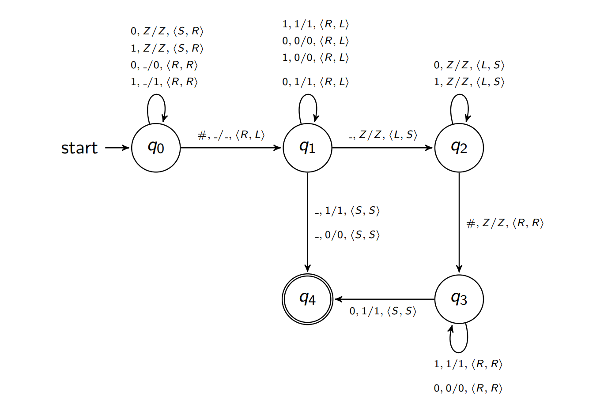

Theoretical Computer Science course. Final assignment #2
=====
### Task description:
Implement a Turing machine according to the graphical representation:



_Expected input_: Two non-empty binary strings with no leading zeroes, separated by `#`. A leading zero is any `0` digit that comes before the first nonzero digit, if any, in a number string.

When your program receives a valid input from `input.txt`, it should output the `output.txt` containing the list of configurations (see configurations format) followed by `YES`or `NO`: `YES`, if a Turing machine accepts the string from the input file and `NO` otherwise. It the input is invalid,  `output.txt` should contain `Invalid input`.

Examples of **valid** input strings: 
+ `0#111`
+ `1011101#1011100`
+ `10101#11`

Examples of **invalid** input strings: 
+ `11#0101#1` 
+ `00011#1010`

### Examples: 

```bash
$ echo 1100#1001 > input.txt
$ python3 TM.py
$ cat output.txt
q0, ^1100#1001, ^Z
q0, ^1100#1001, Z^
q0, 1^100#1001, Z1^
q0, 11^00#1001, Z11^
q0, 110^0#1001, Z110^
q0, 1100^#1001, Z1100^
q1, 1100#^1001, Z110^0
q1, 1100#1^001, Z11^00
q1, 1100#10^01, Z1^100
q1, 1100#100^1, Z^1100
q1, 1100#1001^, ^Z1100
q2, 1100#100^1, ^Z1100
q2, 1100#10^01, ^Z1100
q2, 1100#1^001, ^Z1100
q2, 1100#^1001, ^Z1100
q2, 1100^#1001, ^Z1100
q3, 1100#^1001, Z^1100
q3, 1100#1^001, Z1^100
q4, 1100#1^001, Z1^100
YES
```

```bash
$ echo 01#1001 > input.txt
$ python3 TM.py
$ cat output.txt
Invalid input
```

### Solution:

I decided to write class that represents _TM_ (deterministic) and class that represents _transitions_ between two states
_TM_ class contains list of transitions and `accept_string` function that will pass through all transition and try to apply any of them
 